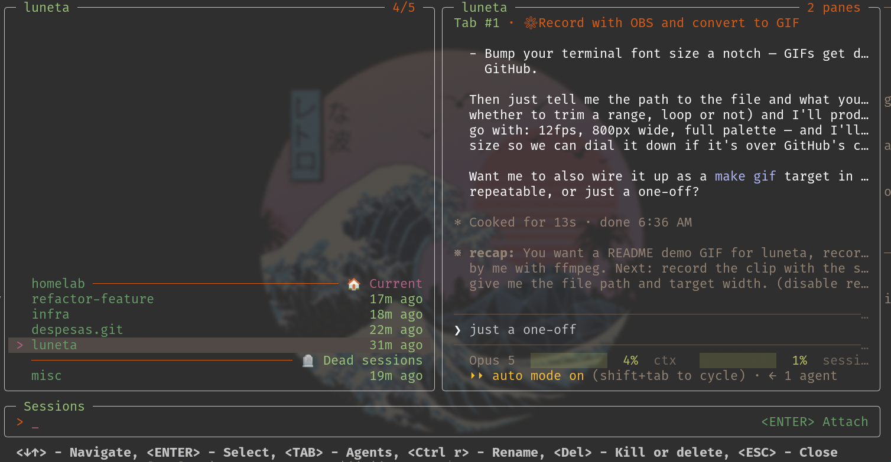
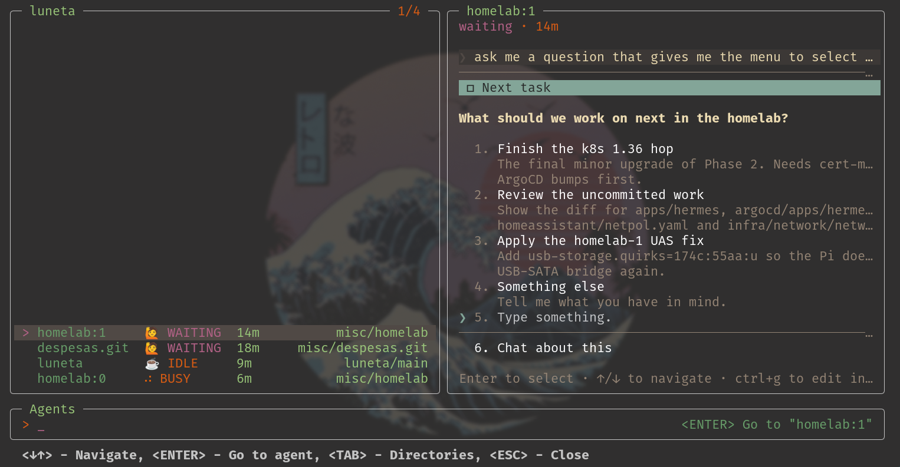
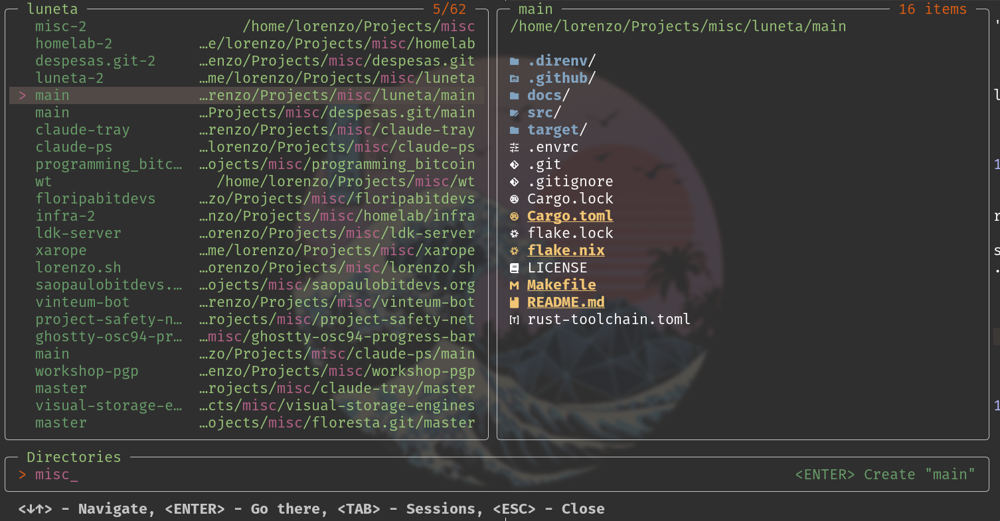

<h1 align="center">luneta</h1>

<p align="center">
  <em>A telescope-style picker for <a href="https://zellij.dev">zellij</a>.<br>
  Type a few characters, press <code>Enter</code>, and you are there.</em>
</p>

<p align="center">
  <a href="https://github.com/lorenzolfm/luneta/releases/latest"></a>
  <a href="#license"></a>
  
</p>

<!--
  MEDIA SLOT — hero.gif
  Record with `make media` (needs charmbracelet/vhs).
  Then point the  below at docs/media/hero.gif.
-->
<p align="center"></p>

---

## What is luneta

A replacement for zellij's default session picker, with sessions, agents and directories tabs.

* Create, hop between and delete sessions
* Jump to the agent that is waiting for you
* Create a session in a directory you work in

| `Tab` | list | `Enter` |
|---|---|---|
| 1 | **Sessions** — live and resurrectable, newest first | attach, resurrect, or create |
| 2 | **Agents** — the agents running and their status | jump to that agent's pane |
| 3 | **Directories** — where you work, in frecency order | create a session there |

Select an item to see a live preview of it.

### Agents

<!--
  MEDIA SLOT — agents.gif
  Recorded by `make media`; swap the  src for docs/media/agents.gif once it exists.
-->
<p align="center"></p>

Know which agents need your attention, and jump straight to them.

| | status | meaning |
|---|---|---|
| 🙋 | `waiting` | it asked you something and stopped |
| ☕ | `idle` | it finished and is waiting for you |
| ⠋⠙⠹⠸ | `busy` | a spinner — the one status that ends on its own |
| 🐚 | `shell` | it is a shell |
| 🛸 | anything else | unknown, and visibly so |

Needs [`claude-ps`](https://github.com/lorenzolfm/claude-ps) on the server's
`PATH`. Without it, the other two lists work exactly as before.

Agent support, today:

| agent | status |
|---|---|
| [Claude Code](https://claude.com/claude-code) | supported, through [`claude-ps`](https://github.com/lorenzolfm/claude-ps) |
| anything else | not yet |

### Directories

<!--
  MEDIA SLOT — dirs.gif
  Recorded by `make media`; swap the  src for docs/media/dirs.gif once it exists.
-->
<p align="center"></p>

Lists the directories you work in, in frecency order, and lets you create a new session right where you want to be.

---

## Getting started

### Requirements

| | | needed for |
|---|---|---|
| **zellij 0.45.0** | | everything |
| [`claude-ps`](https://github.com/lorenzolfm/claude-ps) | optional | the agent list |
| [`zoxide`](https://github.com/ajeetdsouza/zoxide) | optional | the directory list |
| [`eza`](https://github.com/eza-community/eza) | optional | the directory preview |

The session list needs nothing but zellij. The optional tools are looked up by
name on the `PATH` of the zellij **server**, which is inherited from whatever
started it — on a long-lived session that can be older than your shell profile.

### Install

```kdl
plugins {
    // ...
    luneta location="https://github.com/lorenzolfm/luneta/releases/download/v0.2.0/luneta-0.2.0.wasm"
}
```

Zellij will prompt once for `RunCommands`, `ReadApplicationState` and
`ChangeApplicationState`. `RunCommands` is how luneta reaches `zoxide`, `eza`,
`claude-ps` and `zellij` itself.

<details>
<summary><strong>Prefer to verify the bytes first?</strong></summary>

Zellij does not check a checksum, a signature or an attestation on a plugin it
downloads — it fetches the URL and runs the bytes. Every release ships a
`SHA256SUMS` and a keyless build provenance attestation, so you can download,
check, and install from disk instead:

```sh
v=0.2.0
gh release download "v$v" -R lorenzolfm/luneta -p 'luneta-*.wasm' -p SHA256SUMS
sha256sum -c SHA256SUMS
gh attestation verify "luneta-$v.wasm" -R lorenzolfm/luneta
install -m 0644 "luneta-$v.wasm" ~/.local/share/zellij/plugins/luneta.wasm
```

`sha256sum -c` proves the bytes are complete. `gh attestation verify` proves where
they came from: built by `ci.yml`, at that commit, in this repo, on a GitHub
runner. Then point `config.kdl` at the `file:` path instead of the URL.

</details>

### Bind keys

Bind one key to open luneta and use `Tab` to cycle between the tabs, or bind separate keys that open the agents and directories tabs directly.

```kdl
keybinds {
    normal {
        bind "Ctrl j" {
            LaunchOrFocusPlugin "luneta" {
                floating true
                move_to_focused_tab true
            }
            SwitchToMode "normal"
        }
        bind "Ctrl a" {
            LaunchOrFocusPlugin "https://github.com/lorenzolfm/luneta/releases/download/v0.2.0/luneta-0.2.0.wasm" {
                floating true
                move_to_focused_tab true
            }
            MessagePlugin "https://github.com/lorenzolfm/luneta/releases/download/v0.2.0/luneta-0.2.0.wasm" {
                name "screen"
                payload "agents"
            }
            SwitchToMode "normal"
        }
        bind "Ctrl d" {
            LaunchOrFocusPlugin "https://github.com/lorenzolfm/luneta/releases/download/v0.2.0/luneta-0.2.0.wasm" {
                floating true
                move_to_focused_tab true
            }
            MessagePlugin "https://github.com/lorenzolfm/luneta/releases/download/v0.2.0/luneta-0.2.0.wasm" {
                name "screen"
                payload "dirs"
            }
            SwitchToMode "normal"
        }
    }
}
```

---

## Usage

Press your key, type, press `Enter`.

| key | does |
|---|---|
| *any character* | filter, fuzzily |
| `↓` / `↑` | move the highlight |
| `Enter` | act on the highlighted row — the prompt says which action |
| `Tab` / `Shift-Tab` | next / previous list, keeping the search term |
| `Ctrl-r` | rename the session you are in |
| `Del` | kill a live session, or delete a dead one |
| `Backspace` | delete a character |
| `Esc` / `Ctrl-c` | close |

---

## Building from source

Only if you would rather not install a downloaded `.wasm`.

```sh
nix develop          # or: direnv allow, once
make install         # builds and installs to ~/.local/share/zellij/plugins/luneta.wasm
```

The flake pins the rust toolchain with `wasm32-wasip1` added; a system rustc
without that target fails with `error[E0463]: can't find crate for 'std'`.

Then point `config.kdl` at `file:` instead of the release URL:

```kdl
plugins {
    luneta location="file:~/.local/share/zellij/plugins/luneta.wasm"
}
```

## License

MIT. Zellij is MIT-licensed too.
